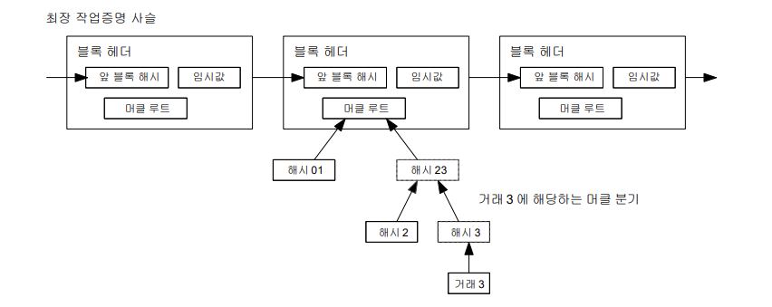
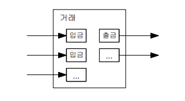

> [발표영상](https://youtu.be/lu88D2jWbUc)

# 간소화한 결제 검증 (Simplified Payment Verification, SPV)

### 기본 개념
- 사용자가 전체 블록체인을 다운로드하지 않고도 거래를 검증할 수 있는 방법.
- 사용자는 네트워크에서 가장 긴 블록체인의 블록 헤더만을 유지하면서, 자신이 수행한 거래를 확인할 수 있다.

### 어떻게 작동하는가
1. **블록 헤더 유지:**
   - 사용자는 네트워크에서 가장 긴 작업증명(Proof of Work) 체인의 블록 헤더 사본을 유지한다.
   - 블록 헤더는 블록체인의 작은 요약 정보로, 각 블록의 해시 값과 타임스탬프가 포함된다.

2. **거래 연결 확인:**
   - 사용자는 자신의 거래가 포함된 블록을 찾고, 이 거래가 타임스탬프가 찍힌 블록에 연결된 머클 분기(Merkle Branch)를 얻는다.
   - 머클 분기는 해당 거래가 블록에 포함되었음을 증명하는 데이터 구조이다.

3. **거래 수락 확인:**
   - 사용자는 자신의 거래가 블록체인 내에서 어디에 위치하는지를 확인하고, 네트워크의 노드들이 해당 거래를 받아들였는지 확인할 수 있다.

### 보안 측면
- 정직한 노드가 네트워크를 제어하는 한, SPV는 신뢰할 수 있다.
- 그러나 공격자가 네트워크를 장악하면, 사용자는 조작된 거래로 속을 수 있다.
- 이를 방지하기 위해, 네트워크 노드의 경고를 받아들여 유효하지 않은 블록을 탐지하고, 온전한 블록과 비교하는 방법이 있다.
- 자주 결제를 받는 기업은 자체 노드를 운영하여 독립적인 보안과 빠른 검증을 유지할 수 있다.

## 금액 합치기와 나누기

### 기본 개념
- 비트코인의 거래는 여러 입금(입력)과 출금(출력)으로 구성된다.
- 금액을 합치고 나누어, 큰 금액은 여러 작은 금액으로, 작은 금액은 합쳐서 큰 금액으로 만들 수 있다.

### 어떻게 작동하는가
1. **거래 정보 구성:**
   - 각 거래는 여러 개의 입금과 출금을 포함할 수 있다.
   - 예를 들어, 큰 금액을 단일 입금으로 하거나, 작은 금액 여러 개를 합쳐서 하나의 입금으로 할 수 있다.

2. **출금 처리:**
   - 출금은 일반적으로 두 개로 나뉜다:
     1. **지불금:** 실제로 받는 사람에게 가는 금액.
     2. **거스름돈:** 발송인에게 돌려주는 금액.

### 부채꼴 구조
- 각 거래가 여러 다른 거래에 의존하고, 이러한 거래들이 더 많은 거래에 의존하는 구조는 문제가 되지 않는다.
- 거래 이력의 완전한 사본을 추출할 필요는 없다. 즉, 거래 내역의 모든 세부 정보를 모두 다룰 필요는 없다.

## 요약

- **간소화한 결제 검증(SPV):** 전체 블록체인을 다운로드하지 않고도 거래를 검증하는 방법으로, 사용자는 가장 긴 블록체인의 블록 헤더만을 유지하고, 머클 분기를 통해 거래를 확인한다.
- **금액 합치기와 나누기:** 비트코인 거래는 여러 입금과 출금을 포함하여 금액을 나누고 합칠 수 있으며, 거래 내역의 부채꼴 구조는 문제되지 않는다.
