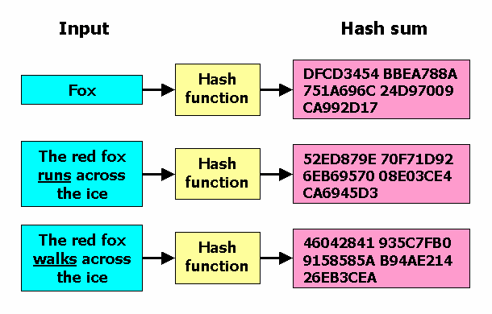
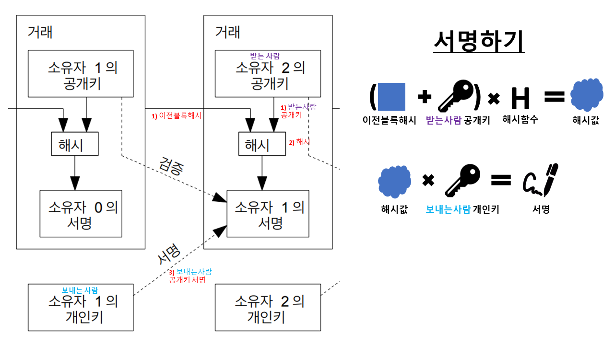
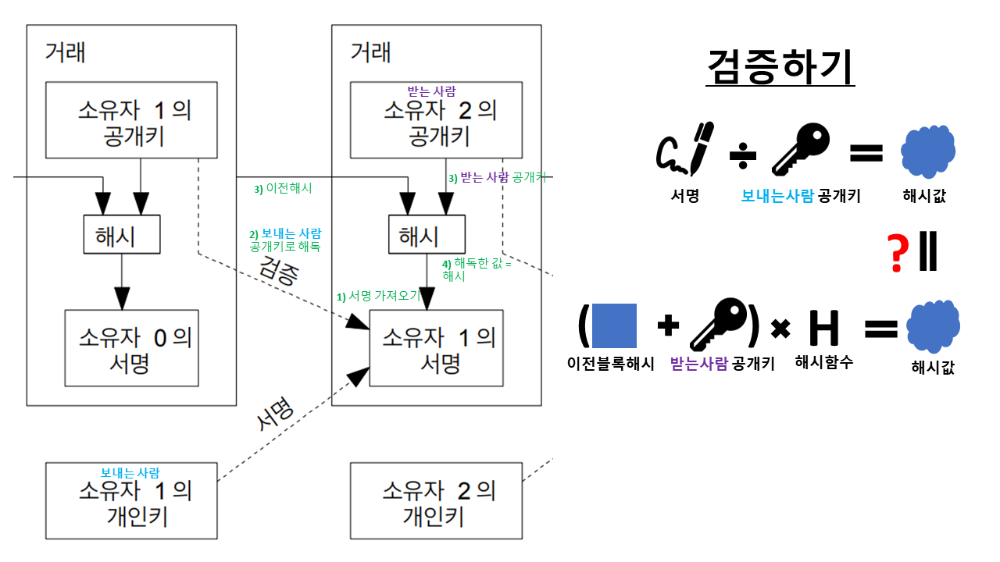
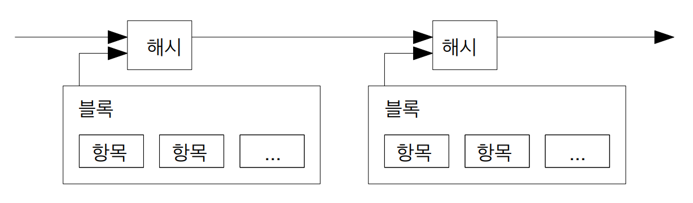
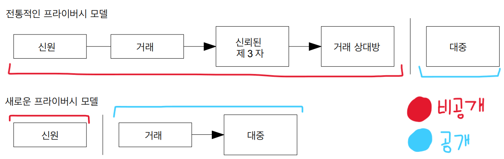
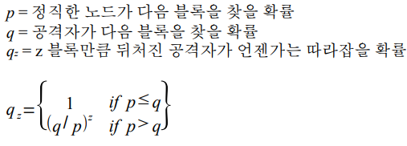

# 2. 거래 (Transactions)
[인플레이션이 오면 누가 이득일까 | 이제는 알아야 할 돈의 흐름 #돈의얼굴](https://www.youtube.com/watch?v=uyqVCnWSGDw)

### 대칭키와 비대칭키
데이터 보호를 위한 두 가지 주요 암호화 방식
- 대칭키: 암호화, 복호화에 사용하는 키가 동일 (키: 나의 비밀번호)
- 비대칭키: 암호화, 복호화에 사용하는 키가 서로 다름 (공개키: 알려져도 됨, 개인키: 나의 비밀번호)

### 해시 (Hash)

> 신원 검증  
임의의 길이의 값을 입력받아 고정된 길이의 결과 값을 출력 (고기와 감자를 잘게 다져 섞어 요리한 것)  
- 중복이 거의 없음
- 무결성 검증과 암호화에 사용됨

### 디지털서명
인증 암호화 기술 (`비대칭키` + `해쉬`)  
> 데이터 검증
- 서명 = 암호화
- 검증 = 복호화
- `신원인증`, `데이터변조 검증`, `부인방지`에 사용됨
(특정한 사람한테만 보낼 수도 있음)

디지털서명의 체인(연속)으로 전자화폐를 만들어서 **과거**의 결제들을 검사

> 소유자1 = 돈 보내는 사람 /소유자2 = 돈 받는 사람

**서명 과정**  

1. (이전 거래 해시값 + 받는사람 공개키)를 해시하기
2. 1번의 해시값을 보내는 사람의 개인키로 서명하기
3. `이전거래 + 받는사람 + 보내는사람 = 서명`을 전파하기 (재료와 결과 같이 전파)

**검증 과정**  (거꾸로 검증)

1. 전파된 재료들과 서명값 가져오기
2. 서명을 보내는 사람의 공개키로 해시 추출하기
3. 추출된 해시가 (이전 거래 해시값 + 받는사람 공개키)의 해시와 같은지 검사하기

(숫자 대입해서 하면 이해 쉬움)

문제는 **미래**의 이중지불을 검증할 수 없다. 제3자에 의존하면 신뢰가 또 필요하므로 X. 이 장에서는 이중지불은 신경쓰지 않고, 거래 검사만 진행

---

# 3. 타임스탬프 서버 (Timestamp Server)
> **우리가 제안하는 해결책은 타임스탬프 서버로 시작한다**  
> => 비트코인 백서는 진짜 주제는 제3자에 대한 신뢰가 필요없는 `이중지불`(**합의 방식**) 해결을 위한 글.

이중지불을 해결하기 위한 여러 장으로 구성되어 있음. 타임스탬프 서버는 구현방법중 하나

특정시점에 데이터 덩어리와 함께 시간 기록해놓기
- 둘 이상의 시각을 비교하거나 기간을 계산할 때 편리하게 사용
- 논리적 타임스탬프 사용: 절대시간이 아닌 상대시간
- 조작을 어렵게 함

**블록 헤더**  
- `버전`: 블록 버전
- `이전 블록 해시`: 이전 블록 헤더 해시한 값
- `머클루트`: 거래 해시값
- `타임스탬프`: 생성시간
- `비츠(bits)`: 난이도
- `논스(nonce)`: 난이도 위한 카운터

---

# 10. 프라이버시 (Privacy)
개인정보가 털리면??
- 보안
- 은행 자산 공개 -> 뱅크런

**전통적인 보안**  
- 제 3자(은행)가 모든 개인정보와 거래를 관리

**새로운 보안**  
모두가 거래를 검증해야 하므로 장부 공개
- 비밀번호 나만 가지고 있음
- 거래와 비밀번호 제외한 개인정보 모두 공개
- 누구계정인지 모름

---

# 11. 계산 (Calculations)
작업증명은 계산으로 증명되므로, 공격자의 계산이 엄청 빠르다면 계좌 조작으로 네트워크가 위험해질 수 있음

### 공격자 시나리오
> 전제조건: 가장 긴 체인을 다들 인정한다.

1. 나쁜놈이 상품 거래를 비트코인으로 지불한다.
2. 상품 판매자가 거래가 블럭에 담기고 6블럭이 지난것을 확인했다.
3. 상품판매자가 나쁜놈에게 물건을 건네주었다.
4. 나쁜놈이 물건을 받고, 집으로가서 슈퍼컴퓨터로 비트코인 블럭 채굴을 시작한다.
5. 성능이 엄청 좋아서 6블럭 이전의 자신의 거래가 포함된 블럭부터 다른 거래로 바꾸어서 다시 새로운 6개를 넘어서 9개정도 블럭을 생성한다.
6. 가장 긴 블럭길이가 되서 모두들 "나쁜놈이 가지고 있는 블럭들이 진짜다"라고 인정한다. (실제로 거래에 이상한 점이 없음.)

나쁜놈이 채굴 성공할 확률 = `q/p` (예. 나쁜놈(q) 5명, 좋은놈(p) 10명이면 `5/10` = `1/2`(50%))  
-> 만약 2블럭 **연속**으로 채굴에 성공하려면 확률을 곱해야 함 `1/2 * 1/2 = 1/4`(25%)  
-> 만약 3블럭이면 `1/2 * 1/2 * 1/2 = 1/8`(12.5%)  
-> 만약 4블럭이면 `(1/2)^4= 1/16`(6.25%)  
-> 만약 N블럭이면 `(1/2)^N`  
-> 지수적으로 증가 (=급격하게 증가)  

- 나쁜놈이 블럭을 채굴하는 동시에 좋은놈도 블럭을 채굴함 = 더 어려움 (확률이 너 낮아짐)
- 비용이 엄청 크므로, 차라리 정직하게 채굴해서 코인 얻는것이 더 이득이 될 수도 있음 (유도책)

---

# 12. 결론
> ## "우리는 `중앙집중된 신뢰`에 의존하지 않는 전자 거래용 시스템을 제안했다"
= 분산된 신뢰를 의존 = 개인의 욕심을 신뢰

- 디지털 서명 -> 기술적 보안
- 작업증명 + 계좌공개 -> 합의방식(이중지불 방지 위해)
- 인센티브 시스템 -> 네트워크 기여 유도

> ## "이 네트워크의 견고함은 비정형적 단순함에 있다"
= 비효율적인데 완전 안전 = **효율성**보다 **안전성**(신뢰)를 목적

