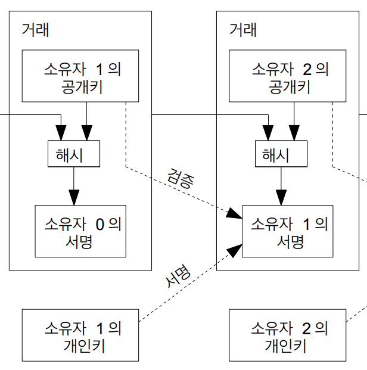

# 2. 거래 (Transactions)

### 대칭키와 비대칭키
데이터 보호를 위한 두 가지 주요 암호화 방식
- 대칭키: 암호화, 복호화에 사용하는 키가 동일
- 비대칭키: 암호화, 복호화에 사용하는 키가 서로 다름

### 해쉬 (Hash)

임의의 길이의 값을 입력받아 고정된 길이의 결과 값을 출력 (고기와 감자를 잘게 다져 섞어 요리한 것)  
- 중복이 거의 없음
- 무결성 검증과 암호화에 사용됨

### 디지털서명
인증 및 무결성을 보장하기 위한 암호화 기술 (비대칭키 + 해쉬 사용)  
- 서명 = 암호화, 검증 = 복호화
- 신원인증, 데이터변조 검증에 사용됨

디지털서명의 체인(연속)으로 전자화폐를 만들어서 **과거**의 결제들을 검사

문제는 **미래**의 이중지불을 검증할 수 없다. 제3자에 의존하면 신뢰가 또 필요하므로 X. 이 장에서는 이중지불은 신경쓰지 않고, 거래 검사만 진행

소유자1 = 돈 보내는 사람, 소유자2 = 돈 받는 사람

**서명 과정**  
1. (이전 거래 해시값 + 받는사람 공개키)를 해시하기
2. 1번의 해시값을 보내는 사람의 개인키로 서명하기
3. `이전거래 + 받는사람 + 보내는사람 = 서명`을 전파하기 (재료와 결과 같이 전파)

**검증 과정**  (거꾸로 검증)
1. 전파된 재료들과 서명값 가져오기
2. 서명을 보내는 사람의 공개키로 해시 추출하기
3. 추출된 해시가 (이전 거래 해시값 + 받는사람 공개키)의 해시와 같은지 검사하기

---

# 3. 타임스탬프 서버 (Timestamp Server)
> **우리가 제안하는 해결책은 타임스탬프 서버로 시작한다**  
> => 비트코인 백서는 제3자에 대한 신뢰가 필요없는 `이중지불`(**합의 방식**) 해결을 위한 글.

이중지불을 해결하기 위한 여러 장으로 구성되어 있음. 타임스탬프 서버는 구현방법중 하나

특정시점에 데이터 덩어리와 함께 시간 기록해놓기

---

# 10. 프라이버시 (Privacy)

---

# 11. 계산 (Calculations)

---

# 12. 결론

