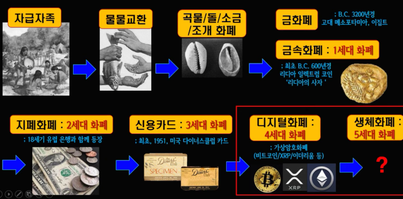

# 머릿말
- 암호화폐: 발행주체가 없는 전자화폐
- 블록체인: 암호화폐의 동작 기술
- 거래소의 수익모델과 새로운 비지니스 모델(기존 모델과 차이점, 예. ICO)
- 직업군: 마케터, 기획자, 개발자, 경제학자(특이한 포지션) (기존 서비스와 다르게 블록체인에 대한 이해 필요)

**자산의 개념**  
주식, 채권, 화폐, 마일리지

**책 목적**  
기술보다 문제중심, 외계어 없이(비유: 경제의 금), 기초 개념

# 1장. 화폐와 비트코인
## 1. 화폐의 본질과 비트코인
  
얍 섬의 화폐 스톤 머니

> **화폐**  
> 신뢰 필요 (보증)
- 법정화폐: 국가가 보증
- 암호화폐: 모든 사용자가 보증
- 금: 역사가 보증

### 화폐의 발전 순서

1. 물물교환  
비슷한 가치물건을 교환

2. 상품 화폐 (편의성 x, 안정성 x)  
조개 껍데기, 진주 등 희귀도를 가진 것

3. 금속 화폐 (편의성 x, 안정성 o)  
금과 은을 주조해서 만듬

4. 종이 화폐 (편의성 o, 안정성 o) (보증기관이 발행)  
정부가 보증하는 종이 (화폐 자체에 가치가 없기 때문에 `신뢰`가 필요해짐)

5. 전자 화폐 (편의성 o(더 높아짐), 안정성 o(낮아짐))  
- 문제점: 중복지불
- 특징: 1대1 거래가 아닌 중개자가 있는 거래로 신뢰를 보증할 제3자 필요(예.은행), 보증기관이 발행
- 사용 비율: 카드(87%) 현금(13%)

6. 암호화폐 (편의성 ?, 안정성 ?)  
- 문제점: 변동성
- 보증기관 없음 -> 보증기관으로 인한 문제점 없어짐 (예. 의도된 인플레이션)

**생각**  
- 발전순서를 보면 사람들에게는 `안정성`보다 `편의성`이 중요한 역할?
- 전자화폐 -> 암호화폐는 어떤걸로 이유로 바뀔까?

### 금융 위기
[리만 브라더스 사태](https://blog.naver.com/june_khj_/223117099854)

1. 주택시장 급속성장으로 가격 거품 낌
2. 낮은 신용에도 은행의 대출
3. 거품이 꺼지면서 주택가격이 낮아서 대출 못갚음
4. 은행의 부도로 이어짐
5. 국가가 은행을 도와줌 (돈 주기)
6. 국가가 재정이 부족해져서 돈 자체 발행 -> 인플레이션
7. 이미 돈을 가지고 있던 사람들의 돈이 가치가 낮아지는 피해 발생

화폐의 발행량은 금본위제를 폐지하면 국가가 조절 가능 -> 통제 가능 -> 피해 발생
그러면 국가가 통제하지 못하는 화폐 만들자 (비트코인)

---

## 2. 비트코인으로 살펴보는 블록체인의 원리
> **법정화폐**  
> 한국은행에서 발행계획 세우고 한국조폐공사에서 발행

은행을 대체하기(없에기) 위한 조건
1. 안전한 데이터 보관
2. 안전한 거래 검증

`신뢰`를 분산시키는(탈중앙화) 작업이 어떻게 가능할까?

**1. 안전한 데이터 보관**  
- 모든 사람이 장부(블록)를 공유
- 신규 거래가 생기면 업데이트 되고 또 공유됨
- 장부에 한번 작성되면 영구적으로 저장, 수정불가 (다른사람이 알아채버림)

**2. 안전한 거래 검증**  
- 모든 참여자 중 랜덤으로 거래를 검증
- 검증에 비용이 요구됨 (작업증명, 해쉬)
- 네트워크의 가치와 연동되는 보상(코인) 지급

네트워크 커짐 -> 자신의 이득 -> 네트워크 잘 운영되서 커짐 -> 자신의 이득 (반복)

**정직하게 유도**  
가정: 나쁜놈은 항상 소수 (유도, 51%공격)
- 코인 가격은 시장과 공급 원리 -> 발행량 고정 -> 수요가 많아지면 가격 상승 -> 보유중인 사람은 자신의 이익을 최대화하기 위해 정직하게 행동

# 정리
- 화폐는 신뢰가 중요
- 완벽한 기술 x 인간의 욕심을 신뢰
- 블럭체인은 컴퓨터 기술뿐만 아니라, 경제, 정치, 사회로 완성되는 기술
- 코인은 목적뿐만 아니리 수단이 될 수 있다 (비트코인 vs IPFS)
- 암호화폐 투자, 폭등락, 조작, 사기, 해킹이 일반 경제보다 난무 (시행착오일까 블록체인의 특성일까?)

