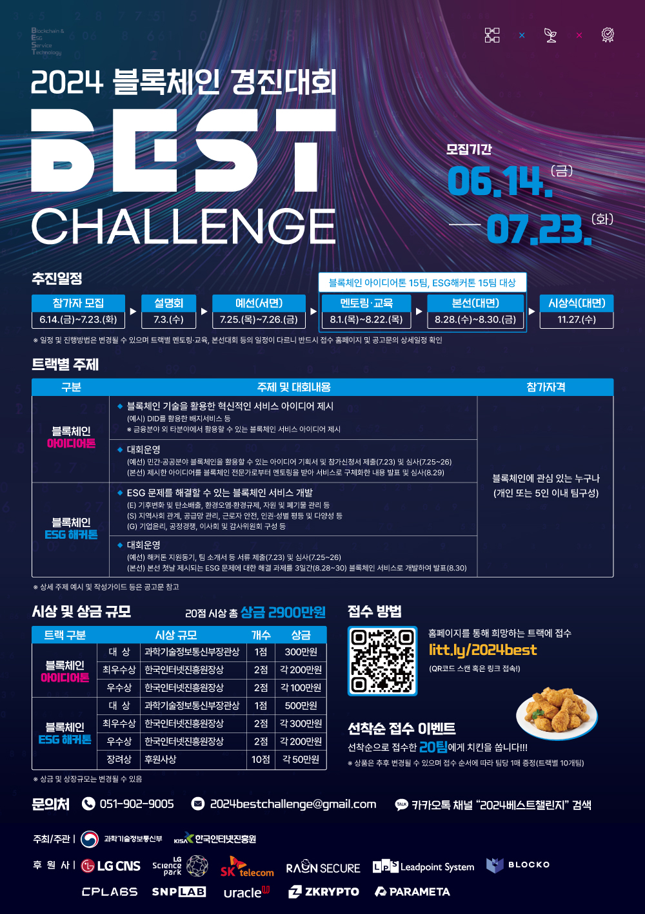

# [2024 BEST Challenge 블록체인 경진대회](https://litt.ly/2024best)
- [2023년 홍보영상](https://www.youtube.com/watch?v=OBEc8t5KANk)
- [공고문](자료/2024_블록체인_경진대회_BEST_Challenge_모집_공고문.pdf)
- [사전 설명회 신청 (7/2 화 24:00 마감)](https://forms.gle/2BBhyWKd7CEdx7Gj7)
- [사전 설명회 영상](https://youtu.be/FSSk-sILRY8?si=yG35_IQFeIh0ppts)

# 트랙
## [아이디어톤](https://forms.gle/eFFkt2XEjDp4pPwe9)
주제 : 블록체인 기술을 활용한 혁신적인 서비스 아이디어 제시
```
※ 금융분야 외 타분야에서 활용할 수 있는 블록체인 서비스 아이디어 제시 (예. DID를 활용한 배지서비스 등)
```


## [ESG해커톤](https://forms.gle/53GLsnytGuMfcJt17)
주제 : ESG 문제를 해결할 수 있는 블록체인 서비스 개발
```
- (E) 기후변화 및 탄소배출, 환경오염·환경규제, 자원 및 폐기물 관리 등
- (S) 지역사회 관계, 공급망 관리, 근로자 안전, 인권·성별 평등 및 다양성 등
- (G) 기업윤리, 공정경쟁, 이사회 및 감사위원회 구성 등
```

# 일정
- 모집기간: 6.14(금) ~ 7.23(화) 14:00
- 사전설명회: 7.3(수) 14:00 ~ 14:30 줌
- 예선: 7.25 ~ 7.26
- 멘토링교육: 8.1(목) ~ 8.22(목)
- 본선: 8.28(수) ~ 8.30(금)

# 문의
051-902-9005 / 2024bestchallenge@gmail.com / 카톡채널 "2024베스트챌린지"