헛소리 하면 잡아주세요

[2024 블록체인 경진대회 「BEST Challenge」](https://festa.io/events/5424)

# 엔화의 역사
세계대전부터 현재까지 시간 흐름 역사

## 세계 2차대전 패

## 1. 미군 점령기 (1945-1952)
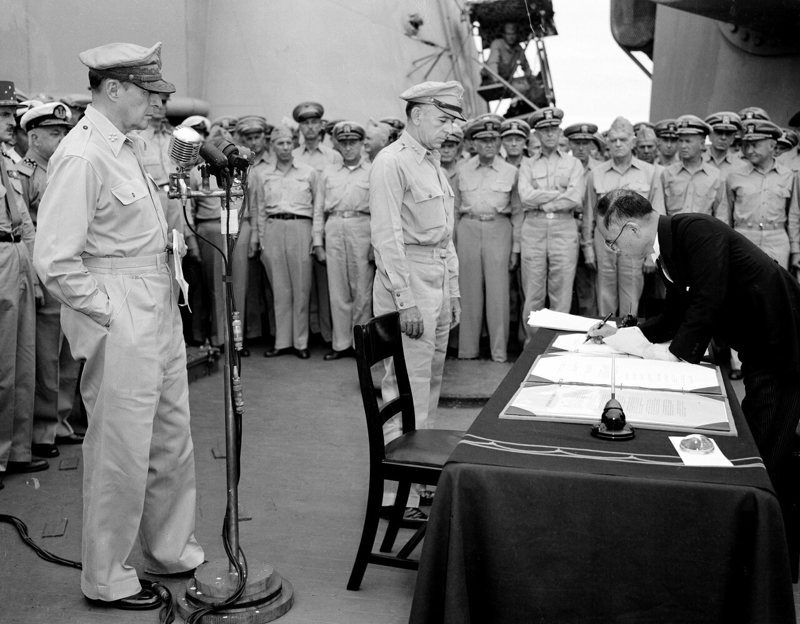

1. 세계2차대전 패배
2. 미군이 일본을 점령 
3. 전범국의 회생을 저지하기 위해 최고사령부 설치, 사회/문화 등 민주화 진행
4. 그런데 사회주의 국가가 주변에 너무 강함

## 2. 미국의 원조와 국제 경제 통합 (1950-1970)
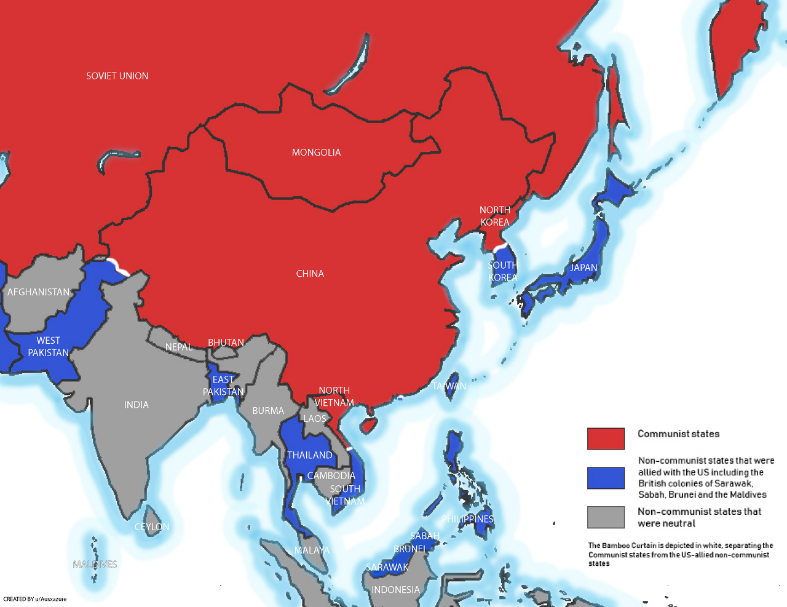

1. 미국의 안보를 위해 아시아권에서 사회주의 세력에 대항할 필요성이 생김
2. 일본의 경제 원조를 결정 (안보 책임지고, 경제 원조)
3. 한국 전쟁, 베트남 전쟁의 폭발적인 수요에 판매를 하며 경제 회복에 큰 도움을 받음
4. IMF, OECD, GATT 등 다양한 단체 가입하면서 국제 무역 경제까지 진출

## 3. 고도 경제 성장기 (1970-)
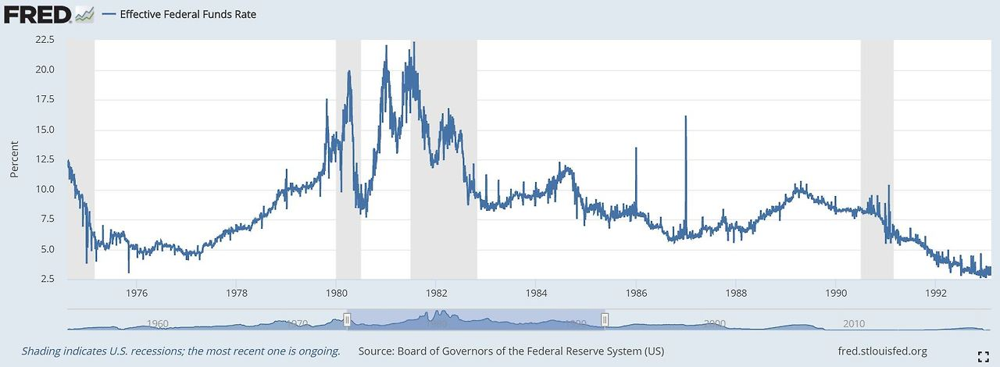  (미국금리)

1. 안보는 미국에게 맡기고, 경제 성장에 중점
2. 경제 성장: 정부 정책으로 중공업/자동차/전자/기술혁신 등 국제 시장에서 성공, 교육 강화까지
3. 오일쇼크 발생(1970,1979): 미국 금리 인상(20%) (물가를 잡기 위해(디플레이션 유도) + 달러 강화로 원자재 수입 유리) -> 미국 기업 박살 -> 경제가 조금 둔화되며 물가는 잡힘 -> 일본의 수출 좋아짐 (에너지 효율성을 높이는 정책+미국기업박살+엔화 약세(미국 금리가 높아 미국으로 돈이 움직여서 달러 강세됨))

## 4. 경제대국 (1985-)
1. 오일쇼크 이후 미국의 안좋은 경제상황을 달러 약화로 타개(플라자합의) -> `빚 탕감`(부채 부담 감소) + `수출 이득`
2. 엔화 강세 -> 일본은 수출이 어려워져 내수경기 부양 정책으로 변경 -> 일본으로 자본 이동 -> 주가 상승 (시장으로 자본이 많이 들어와서 회사들이 은행(대출 이자)에서 돈을 빌리지 않게 됨 왜냐면 투자받기 쉬움)
3. 은행들이 가계를 대상으로 사업시작(주택담보대출비율=120% (현재 우리나라는 40%)) -> `저금리 + 자본유입 + 은행경쟁`으로 부동산 시장 계속 상승

## 5. 버블 (1985-1989)
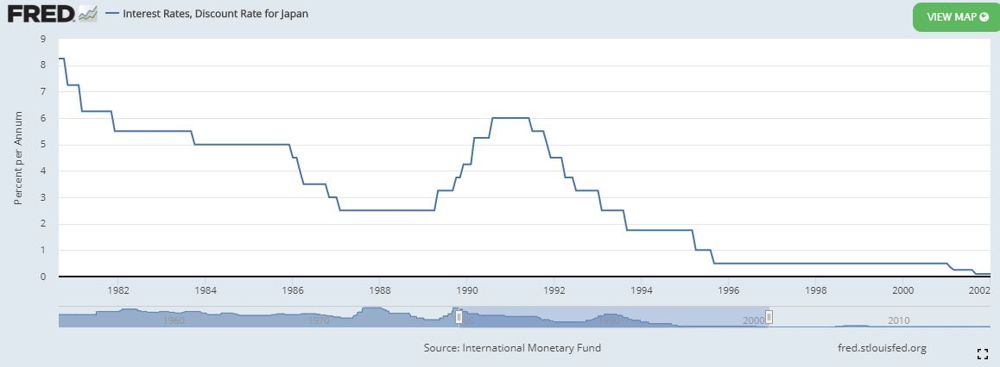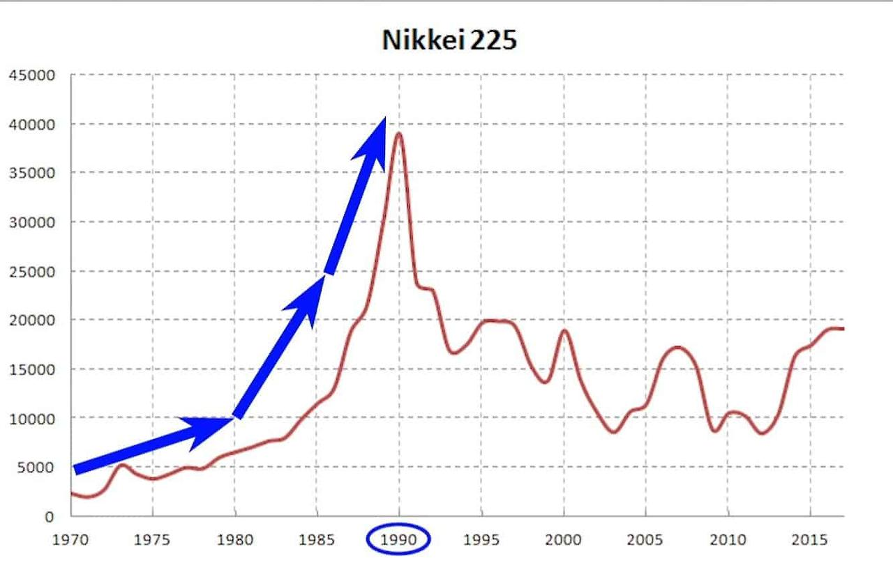 (1)일본금리 (2)일본주식

1. 1987년 미국 주식(다우지수) 22% 대폭락 (버블 터짐) -> 미국이 시장에 큰 타격이 가지 않게 금리 인하 (돈 풀어서 활성화), 미국 은행이 다른 나라 은행에 금리 인하 요청 (자본이 금리 높은곳으로 이동해서 미국 경제가 둔화되는것을 막으려고)
2. 하지만 일본은 지금 시장에 돈이 많아서(인플레이션 상황) 금리 인하 못함
3. 1989년 미국이 일본 성장 제제 (미일 구조 협의) -> 내수 시장 개방, 일본의 수출을 줄이고 수입을 많이 하도록 유도
4. 일본 정부 국토 부동산 재개발(대규모 일자리로 내수시장 활성화) -> 물가 오르기 시작(대출 더 받으며) -> 정부: 금리 대폭 인상 -> 주가 40% 폭락 -> 부동산 폭락
5. 버블 터지면서 경제 패닉 시작

## 6. 버블 이후 1 (1990-)
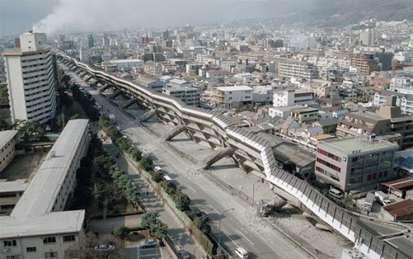  (1)고베대지진 (2)걸프전

1. 심한 패닉 경제 부양을 위해 금리 인하를 빠르게 해야하는데, 세계상황: "걸프전으로 유가 상승 -> 물가상승이 됨, 그런데 금리 낮추면 물가가 더 올라가는것" 을 방지하기 위해 금리 인하 속도를 늦춤
2. 너무 느린 금리 인하로 시장이 얼어버림
3. 정부는 도로건설 등 활성화 유도, 금리 계속 인하했지만.. 지진까지 발생
4. 기업과 보험회사가 해외자본을 엔화로 바꿔서 재건에 도움 -> 엔화 초강세 됨 -> 수출 어려워 짐 
5. G7회담에 엔화 약세 요구, 금융기관 부실 문제가 경제에 영향이 큰거같아서 정책 변경 (금융기관을 통해 유동성을 공급해서 경기부양이 최선인것 같다)

## 7. 버블 이후 2
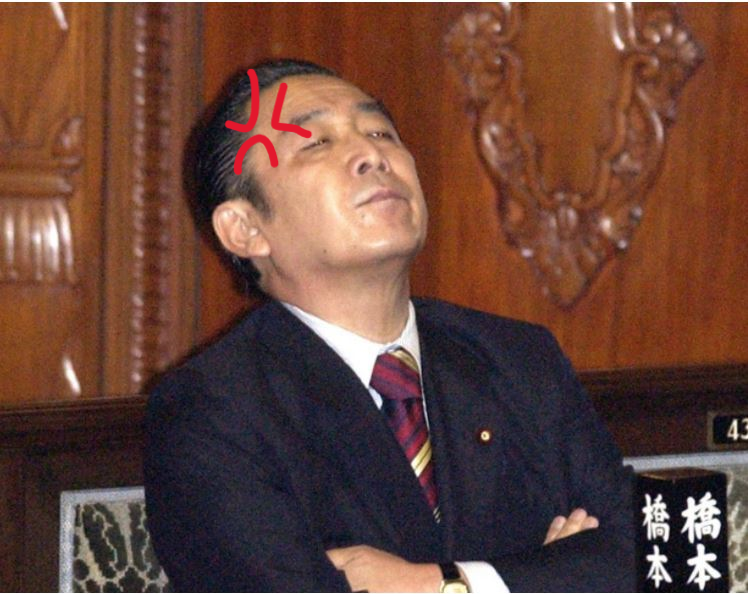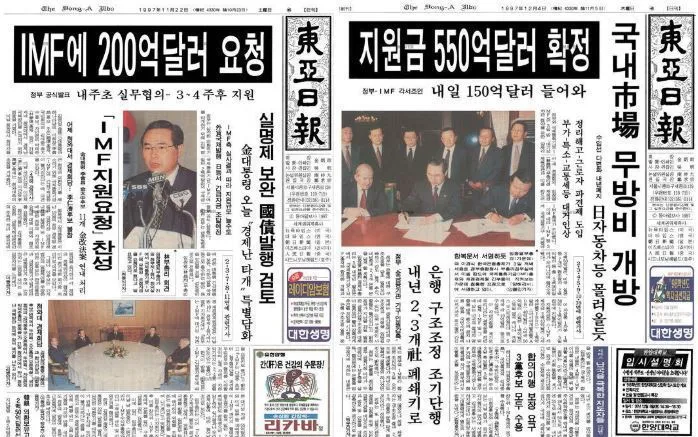  (1)머리아픈 일본인 (2)IMF 구제금융
1. 그런데 금융기관 유동성 공급으로 시장 활성화가 아닌, 눈앞의 불을 끄기 위해 부동산 경기부양에 직접 재정 낭비를 함 (미국은 2008년 경제 대공황때, 이 사건을 보고 금융기관에 유동성 공급을 함)
2. 정부가 빚을 내며 경기 부양 시도 (1996, GDP대비 70%)
3. 재정 빚 탕감을 위해 세금 업 -> 경기 둔화
4. 1997 아시아 외환위기 -> 일본기업들의 외국 시장에 투자한 자본이 하락함 -> 은행, 증권사 파산

## 7. 버블 이후 3 (2000-)
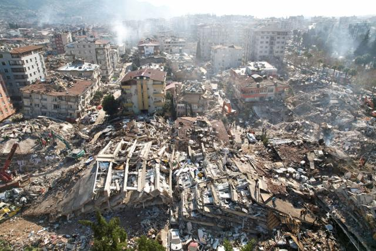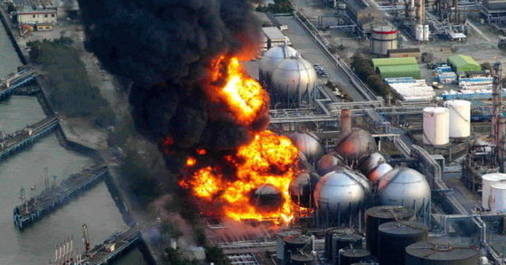  (1)리만브라더스 사태 (2)동일본 대지진 (3)후쿠시마 원전 폭발
1. 이제 금융기관을 중심으로 살리기 시작 (금융기관에게 부실채권 청산 요구)
2. 부실 기업 청산됨 -> 실업자 증가 -> 잠시 경기둔화
3. 추가로 정부 빚 탕감을 위해 5년간 통화 발행 시작 -> 인플레이션 -> 토지, 수출 완화되서 경기 살아남
4. 인플레이션 무서워서 잠시 발행 중지 
5. 미국 경제대공황 발생 -> 미국 금리 축소 -> 일본으로 자본 움직여서 엔화 강세
6. 2011년 동일본 대지진 -> 엔화 더블 강세
7. 후쿠시마 원전사고 -> 엔화 더블더블 강세
8. 경제와 수출 둔화

## 8. 2010년
1. 재선당시 경제 상황이 안좋아 민주당 패배 후 아베 당선
2. 경기 부양을 위해 3개 화살 정책 시행, 통화 발행 시작
....

너무 길어서 5주차에 이어서 하겠습니다.

# 느낀점
- 복잡하다
- 금융위기는 미국처럼 기축통화 발권력을 가진 상태가 아니면 왠만해서 재기하기 힘든거같다.
- 상황에 따라서 외수시장과 내수시장 초점을 맞춰서 경기를 부양하는것 같다
- 수출은 경기를 부양(상승 유도)하는데 좋은것 같고, 수입은 경기 하락을 방어하는데 좋은것 같다.

---

# 기타등등
- 플라자합의
- 아베노믹스
- 마이너스 금리
- 엔고와 엔저
- 엔화가 안전한 이유
- 환율 개념
- 최근 금리 인상 이유

## 플라자합의 (Plaza Accord) 1985년
> 미국 달러의 과도한 강세를 완화하고 무역 불균형을 해소하기 위해 미국, 일본, 서독, 프랑스, 영국 등 5개국 재무장관과 중앙은행 총재들이 모여 체결한 합의

1. 1980년대 초반, 미국은 높은 달러 가치로 인해 무역 적자가 심화 (환율이 강하면 무역 힘듬)
2. 미국 내 산업 경쟁력이 약화
3. 플라자 합의 
4. 각국 중앙은행이 외환 시장 개입 (달러 매도, 자국통화 매입)
5. 달러 약세 유도됨

## 아베노믹스 (Abenomics) 2012년
> 일본 경제를 재건하고 디플레이션을 탈출하기 위한 목적 (3개 화살: 통화 정책의 완화, 재정 정책의 확대, 구조적 개혁)

1. 1990년대 이후 일본은 장기적인 경제 침체와 디플레이션
2. 아베의 경제 정책을 추진 (마이너스 금리 -> 대출 유도 -> 시장 활성화)
3. 하지만, 힘듬 (문화적인 이유, 시민들의 두려움, 고령화로 생산력 감소, 공공(정부) 부채 너무 큼)

## 마이너스 금리 (Negative Interest Rate) 2016년
> 예금 금리를 0% 이하, 시중은행들이 시장에 돈을 뿌리기 위한 패널티

1. 버블경제 터진 여파를 회복하려고 함
2. 금리를 낮춰서 대출을 유도해 시장에 돈을 투입시켜 경제 활성화 유도

## 엔고와 엔저
- **엔고**: 엔화의 가치가 상승하여 달러나 다른 외국 통화에 비해 강세를 보이는 현상.
- **엔저**: 엔화의 가치가 하락하여 달러나 다른 외국 통화에 비해 약세를 보이는 현상.

- 통화 가치가 강하면: 수출 경쟁력을 저하, 수입품의 가격을 낮추고 해외 자산의 가치를 높임
- 통화 가치가 약하면: 수출에 유리, 수입 물가 상승과 인플레이션 유발 가능

## 엔화가 안전한 이유
> 안전자산의 인식
국제 금융 시장에서 안전자산으로 간주되서 글로벌 경제 위기나 불확실성이 클 때 투자자들이 선호

1. 일본 금리가 세계에서 상대적으로 낮음
2. 엔화로 대출을 한 뒤, 해외에 투자를 함
3. 만약 위기 상황 발생시, 해외자산 팔고 엔화를 구입하므로(=엔화 공급대비 수요 증가), 엔화 가치가 높아짐

- **일본의 경제력**: 세계 3위의 경제 대국으로 경제적 기반이 튼튼
- **안정된 금융 시스템**: 금융 시스템은 안정적, 정부와 중앙은행의 신뢰가 높음
- **정치적 안정성**: 정치적 안정성이 높은 국가로 평가받음
- **풍부한 외환보유고**: 많은 외환보유고를 보유, 금융 위기 시 엔화 방어 가능

## 환율 개념
> 상대적인 개념

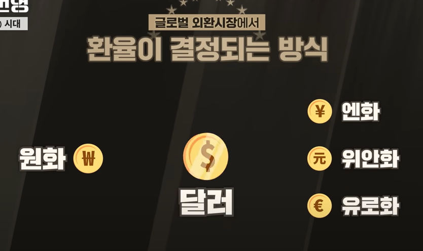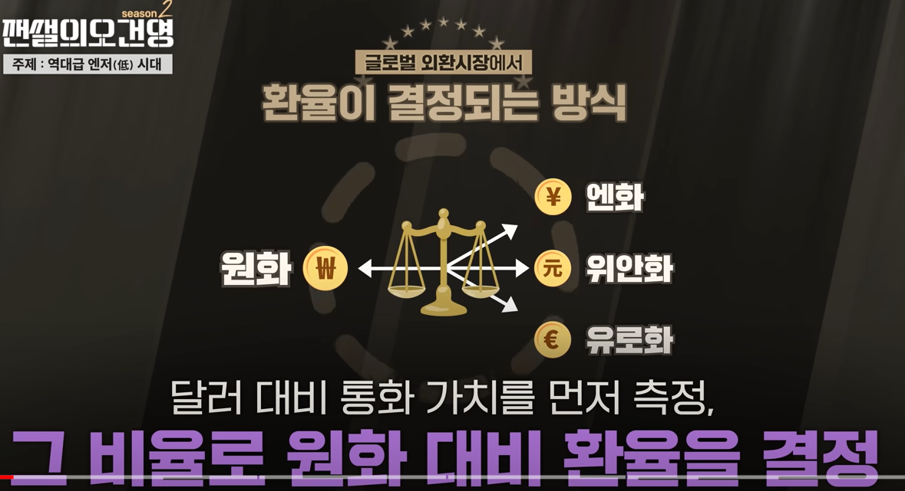
원래는 금이 가치가 제일 안정적이어서 통화 거래시 기준값으로 사용됬지만, 미국이 금본위제를 폐지하고, 세계 시장에서 달러를 기준으로 거래를 하게 되어서, 현재는 달러가 통화 거래시 기준값으로 사용됨 (=변동환율제)

두 나라간의 통화 교환 비율
- 달러-엔 환율
- 원-엔 환율

현재 엔화가 약세인 이유는 일본의 상대적인 저금리 정책 영향

## 최근 일본 금리 인상 이유
> 한 줄 정리: 물가를 안정시키기 위해서

1. 세계적인 강한 인플레이션의 여파 (전쟁->원자재 비싸짐, 코로나 시기 양적완화 등)
2. 다른 나라 금리 높음 -> 높은 금리로 수익을 더 얻기 위해 일본의 자산이 해외로 이동
3. 일본은 아직 저금리(경기 부양 더 해야함) -> 양적 완화중 -> 상대적으로 통화가치 더 하락
4. 엔화 약세가 됨 (원에 대한 환율뿐 아니라 달러(세계적) 환율에도 약해짐)
5. 환율이 낮아짐 -> 수출 유리, 수입 불리(수입 물가가 높아져 일본 소비자 물가가 높아짐)
6. 물가를 안정시키기 위해 금리 인상 (하지만 너무 올리면 저금리 기간 떄문에 공공 부채(채권 등)가 너무 많아 갚아야 할 이자가 커짐)

# 참고
- [토스피드: 인플레이션](https://blog.toss.im/article/what-is-inflation)
- [역대급 엔저현상의 원인과 향후 변동 가능성은? #쩐썰의오건영 (Ep. 16)](https://www.youtube.com/watch?v=Xt9Er96cZVc)
- [일본 경제 역사](https://monsterofcapitalistic.tistory.com/category/%EC%9D%BC%EB%B3%B8%20%EA%B2%BD%EC%A0%9C%20%EC%97%AD%EC%82%AC?page=1)

chatgpt 대화 (펼치기)

# 나
저는 경제 동아리에서 엔화에 대해 소개를 맡았습니다. 아래 초안을 토대로 엔화의 역사부터 다양한 관점까지 자세하게 작성해주세요.
# 엔화의 역사

**엔화는 세계에서 왜 안전하다고 할까??**

## 기타 등
- 플라자합의
- 아베노믹스
- 마이너스 금리
- 환율 개념

# GPT
엔화(엔, JPY)는 일본의 공식 통화로, 그 역사와 특성은 국제 경제와 금융 시장에서 중요한 역할을 하고 있습니다. 엔화에 대한 포괄적인 소개를 위해 역사적 배경부터 최근의 경제 정책과 환율 개념까지 다루어 보겠습니다.

## 엔화의 역사

엔화는 1871년 일본 정부가 현대적 통화 체제를 도입한 이후부터 사용되기 시작했습니다. 초기에는 금 기반의 통화였으나, 1949년 이후로는 미국 달러와의 고정환율제를 통해 금융 시장에서의 안정성을 유지해 왔습니다. 1985년에는 브라디 평가 이후 엔화의 환율이 조정되었으며, 이는 일본의 수출 경제의 경향에 큰 영향을 미쳤습니다.

## 엔화의 안정성

엔화는 국제 금융 시장에서 안전자산으로 간주되며, 이는 다양한 요인들로부터 기인합니다. 첫째로, 일본은 금융 시스템의 안정성과 신뢰성을 유지해 왔습니다. 둘째로, 일본은 경제 대국으로서의 역할을 하며 글로벌 경제의 주요 참여자로 자리 잡고 있습니다. 마지막으로, 엔화는 일본 정부와 중앙은행의 지속적인 경제 정책으로 지지받고 있습니다.

## 주요 사건과 정책

### 플라자 합의 (Plaza Accord)

1985년에 열린 플라자 호텔에서 열린 회의를 통해, 미국, 일본, 독일, 영국, 프랑스 등의 주요 경제 국가들은 달러의 과도한 강세를 완화시키기 위한 조치로 환율을 조정했습니다. 이로 인해 엔화의 환율이 상승하게 되었고, 이는 일본의 수출 경제에 막대한 영향을 미쳤습니다.

### 아베노믹스 (Abenomics)

2012년에 일본의 총리로 취임한 아베 신조는 경제 회복을 위한 아베노믹스라는 정책을 추진했습니다. 이 정책은 "3의 화살"이라고 불리며, 통화 정책의 완화, 재정 정책의 확대, 구조적 개혁을 포함하고 있습니다. 아베노믹스는 일본 경제를 다시 살리는 데 큰 역할을 하였으며, 엔화의 국제적인 위치 또한 강화시켰습니다.

## 현재의 도전과제들

### 마이너스 금리 정책

일본은 경기 부양을 위해 마이너스 금리 정책을 도입하였습니다. 이는 일본 경제의 활성화를 목적으로 하였으나 금융 시장에 부정적인 영향을 미칠 수 있습니다.

## 결론

엔화는 그 안정성과 국제적인 신뢰로 인해 글로벌 경제에 중요한 역할을 하고 있습니다. 엔화의 역사와 정책적 변화는 일본 경제의 발전과 글로벌 경제의 움직임을 이해하는 데 중요한 지표로 작용하고 있습니다.
---

# 나
일본은 2차 세계대전에서 패했는데 어떻게 경제를 회복하고 경제대국이 됬나요?

# GPT
일본이 제2차 세계대전에서 패한 후 어떻게 경제를 회복하고 경제대국으로 성장했는지를 이해하려면, 몇 가지 주요 요인들을 살펴보아야 합니다. 이는 경제 정책, 국제 지원, 인프라 및 기술 발전 등을 포함합니다.

## 1. 미군 점령기와 초기 재건 (1945-1952)

### 초기 재건과 경제 개혁

- **미군 점령기:** 제2차 세계대전이 끝난 후, 일본은 미군에 의해 점령되었습니다. 이 시기는 일본 사회와 경제의 재구조화에 중요한 역할을 했습니다.
- **경제 개혁:** 미군은 일본의 경제 구조를 개혁하기 위해 농지 개혁, 재벌 해체, 노동 운동 지원 등 다양한 개혁을 실시했습니다. 이러한 개혁은 경제 민주화를 촉진하고, 경제 성장을 위한 기초를 마련했습니다.

## 2. 미국의 원조와 국제 경제 통합

### 마셜 플랜과 지원

- **미국의 경제 원조:** 일본은 미국으로부터 상당한 경제 원조를 받았습니다. 이는 일본 경제 회복에 중요한 역할을 했습니다. 특히, 한국 전쟁(1950-1953) 동안 일본은 군수물자 공급 기지로서 역할을 하여 경제 회복에 큰 도움을 받았습니다.

### 국제 경제 통합

- **국제 경제 기구 참여:** 일본은 1955년 GATT(관세 및 무역에 관한 일반 협정)에 가입하고, 1964년에는 IMF(국제통화기금)와 OECD(경제협력개발기구)에 가입하면서 국제 경제에 통합되었습니다. 이는 일본의 무역 확대와 경제 성장을 촉진했습니다.

## 3. 고도 경제 성장기 (1950-1973)

### 산업화와 기술 발전

- **산업 정책:** 일본 정부는 중공업, 자동차, 전자 등 첨단 산업에 집중하여 경제 성장을 촉진했습니다. 정부는 기업에 대한 지원과 보호 정책을 통해 산업화를 가속화했습니다.
- **기술 혁신:** 일본은 기술 혁신에 집중하여 생산성을 크게 향상시켰습니다. 이는 기업들이 경쟁력을 확보하고 국제 시장에서 성공할 수 있도록 도왔습니다.

### 교육과 인력 개발

- **교육 시스템 강화:** 일본은 교육에 많은 투자를 하여 고급 인력을 양성했습니다. 이는 기술 혁신과 경제 성장에 중요한 역할을 했습니다.

## 4. 경제대국으로의 도약 (1973-1990)

### 에너지 위기 극복

- **에너지 효율성 향상:** 1970년대의 오일 쇼크를 겪으면서, 일본은 에너지 효율성을 높이는 정책을 추진했습니다. 이는 일본 경제의 안정성과 지속 가능성을 높였습니다.

### 품질 경영과 제조 혁신

- **품질 관리:** 일본 기업들은 품질 관리와 제조 혁신에 집중하여 글로벌 시장에서 경쟁력을 확보했습니다. 이는 일본 제품의 신뢰성과 인기를 높이는 데 기여했습니다.

## 5. 도전과 지속 가능성 (1990년 이후)

### 자산 버블과 경제 조정

- **자산 버블:** 1980년대 말, 일본은 자산 가격이 급등하는 경제 버블을 경험했으며, 이는 1990년대 초에 붕괴되었습니다. 이후 일본은 장기적인 경제 침체와 디플레이션을 겪었습니다.
- **경제 조정:** 일본 정부와 기업들은 구조 개혁과 경제 조정을 통해 새로운 경제 성장 모델을 모색했습니다.

### 현대적 과제

- **고령화와 인구 감소:** 일본은 고령화와 인구 감소 문제를 겪고 있으며, 이는 경제 성장과 사회 복지 시스템에 큰 도전 과제입니다.
- **혁신과 디지털화:** 일본은 디지털 혁신과 새로운 산업 발전을 통해 경제 성장을 지속하려고 노력하고 있습니다.

## 결론

일본은 전후의 혼란 속에서도 정부의 강력한 경제 정책, 국제 사회의 지원, 기술 혁신과 교육에 대한 집중을 통해 경제를 회복하고 성장시킬 수 있었습니다. 이러한 요소들이 결합되어 일본을 오늘날의 경제대국으로 만들었습니다.

---

# 나
이번엔 아래의 리스트들의 각각의 개념과 역사와 이유들을 자세하게 모두 설명해주세요.

플라자합의
아베노믹스
마이너스 금리
엔고와 엔저
엔화가 안전한 이유
환율 개념
최근 금리 인상 이유

# GPT
## 플라자합의 (Plaza Accord)

### 개념
플라자합의는 1985년 9월 22일 뉴욕의 플라자 호텔에서 미국, 일본, 서독, 프랑스, 영국 등 5개국 재무장관과 중앙은행 총재들이 모여 체결한 합의입니다. 이 합의는 미국 달러의 과도한 강세를 완화하고 무역 불균형을 해소하기 위한 목적으로 이루어졌습니다.

### 역사
1980년대 초반, 미국은 높은 달러 가치로 인해 무역 적자가 심화되고 있었습니다. 이에 따라 주요 무역 상대국들과의 무역 불균형이 커지면서 미국 내 산업 경쟁력이 약화되었습니다. 이를 해결하기 위해 플라자합의가 체결되었으며, 주요국들은 공동으로 달러 약세를 유도하기로 합의했습니다.

### 이유
플라자합의의 주요 목표는 달러 약세를 통해 미국의 무역 적자를 줄이고, 각국 간의 무역 균형을 회복하는 것이었습니다. 이 합의는 각국 중앙은행들이 외환 시장에 개입하여 달러를 매도하고 자국 통화를 매입하는 방식으로 진행되었습니다.

## 아베노믹스 (Abenomics)

### 개념
아베노믹스는 2012년 일본 총리로 취임한 아베 신조의 경제 정책으로, 일본 경제를 재건하고 디플레이션을 탈출하기 위한 목적으로 추진되었습니다. "3개의 화살"로 불리는 통화 정책의 완화, 재정 정책의 확대, 구조적 개혁이 핵심 요소입니다.

### 역사
1990년대 이후 일본은 장기적인 경제 침체와 디플레이션을 겪고 있었습니다. 아베 총리는 이러한 상황을 타개하기 위해 대담한 경제 정책을 추진했습니다. 2012년 이후 일본은행은 대규모 금융 완화를 시행했고, 정부는 인프라 투자와 재정 지출을 확대했으며, 각종 규제 완화를 통해 경제 구조 개혁을 시도했습니다.

### 이유
아베노믹스의 목표는 일본 경제의 성장률을 높이고 디플레이션을 종식시키며, 기업의 경쟁력을 강화하는 것입니다. 이를 통해 지속 가능한 경제 성장을 이루고자 했습니다.

## 마이너스 금리 (Negative Interest Rate)

### 개념
마이너스 금리 정책은 중앙은행이 시중 은행에 부과하는 예금 금리를 0% 이하로 설정하는 정책입니다. 이로 인해 시중 은행들은 중앙은행에 돈을 예치하는 대신 대출을 늘리거나 투자에 나서게 됩니다.

### 역사
2016년 1월, 일본은행은 마이너스 금리 정책을 도입했습니다. 이는 세계 금융 위기 이후 유럽중앙은행(ECB)과 함께 주요 중앙은행 중 처음으로 마이너스 금리를 도입한 사례 중 하나입니다.

### 이유
마이너스 금리 정책의 목표는 은행들이 자금을 중앙은행에 예치하지 않고 대출과 투자를 통해 경제 활동을 촉진하도록 유도하는 것입니다. 이를 통해 경제 성장을 촉진하고 디플레이션을 방지하려는 목적이 있습니다.

## 엔고와 엔저

### 개념
- **엔고**: 엔화의 가치가 상승하여 달러나 다른 외국 통화에 비해 강세를 보이는 현상.
- **엔저**: 엔화의 가치가 하락하여 달러나 다른 외국 통화에 비해 약세를 보이는 현상.

### 역사
엔화는 1980년대 중반 플라자합의 이후 크게 평가절상되었고, 이는 일본의 수출 산업에 큰 영향을 미쳤습니다. 1990년대 이후에는 엔고와 엔저를 반복하며 일본 경제에 다양한 영향을 미쳤습니다.

### 이유
엔고는 일본의 수출 경쟁력을 저하시켜 경제 성장에 부정적인 영향을 미칠 수 있지만, 수입품의 가격을 낮추고 해외 자산의 가치를 높이는 긍정적인 효과도 있습니다. 반대로 엔저는 수출을 촉진하지만, 수입 물가 상승과 인플레이션을 유발할 수 있습니다.

## 엔화가 안전한 이유

### 개념
엔화는 국제 금융 시장에서 안전자산으로 간주됩니다. 이는 글로벌 경제 위기나 불확실성이 클 때 투자자들이 선호하는 자산입니다.

### 이유
엔화가 안전자산으로 여겨지는 주요 이유는 다음과 같습니다:
- **일본의 경제력**: 일본은 세계 3위의 경제 대국으로, 경제적 기반이 튼튼합니다.
- **안정된 금융 시스템**: 일본의 금융 시스템은 안정적이며, 정부와 중앙은행의 신뢰가 높습니다.
- **정치적 안정성**: 일본은 정치적 안정성이 높은 국가로 평가받고 있습니다.
- **풍부한 외환보유고**: 일본은 상당한 외환보유고를 보유하고 있어, 금융 위기 시에도 자국 통화를 방어할 수 있습니다.

## 환율 개념

### 개념
환율은 두 국가의 통화 간 교환 비율을 의미합니다. 이는 외환 시장에서 결정되며, 경제 상황, 금리, 무역 수지, 정치적 안정성 등 다양한 요인에 의해 영향을 받습니다.

### 역사
환율은 금본위제, 브레튼우즈 체제 등을 거쳐 현재의 변동환율제로 발전해 왔습니다. 각국은 자국 경제 상황에 맞춰 환율 정책을 조정하며, 이는 국제 무역과 금융에 중요한 영향을 미칩니다.

## 최근 금리 인상 이유

### 개념
중앙은행의 금리 인상은 일반적으로 경제 과열을 방지하고 인플레이션을 억제하기 위한 목적이 있습니다.

### 역사와 이유
최근 몇 년간 많은 국가들이 코로나19 팬데믹 이후 경기 회복 과정에서 금리를 인상하고 있습니다. 주요 이유는 다음과 같습니다:
- **인플레이션 억제**: 팬데믹 이후 경기 부양책과 공급망 문제로 인해 인플레이션이 급등하였으며, 이를 억제하기 위해 금리 인상이 필요했습니다.
- **경제 과열 방지**: 저금리로 인한 과도한 투자와 소비를 억제하여 경제 과열을 방지하고자 합니다.
- **통화 정책 정상화**: 팬데믹 동안 시행한 비정상적인 통화 정책을 정상화하여 경제의 장기적인 안정을 도모하기 위함입니다.

## 결론

이러한 요소들을 종합해보면, 일본의 경제 회복과 성장, 그리고 엔화의 특성 및 안전자산으로서의 지위는 복합적인 역사적 배경과 정책적 선택에 기인합니다. 일본은 다양한 경제 정책과 국제적 환경 변화에 대응하며 경제 대국으로 자리잡았고, 이는 세계 경제와 금융 시장에서도 중요한 의미를 가집니다.

---

# 나
아래에 대한 것들도 자세하게 알려주세요
- 일본이 장기적인 경제 침체와 디플레이션을 겪고 있는 역사와 이유와 계속 해결하지 못하고 있는 이유
- 일본이 최근 금리를 인상하기 시작한 이유

# GPT
## 일본의 장기적인 경제 침체와 디플레이션

### 역사

### 1. 버블 경제와 붕괴 (1980년대 후반 - 1990년대 초반)

- **버블 경제 형성**: 1980년대 후반, 일본은 부동산과 주식 시장에서 과열된 투기 붐을 겪었습니다. 이는 금융 기관의 무분별한 대출과 정부의 느슨한 통화 정책에 의해 촉진되었습니다.
- **버블 붕괴**: 1990년대 초반, 부동산과 주식 시장의 거품이 꺼지면서 자산 가격이 급락했습니다. 이로 인해 금융 기관들이 대규모 부실 채권을 안게 되었고, 경제 전반에 심각한 영향을 미쳤습니다.

### 2. 잃어버린 10년 (1990년대 - 2000년대 초반)

- **금융 위기와 디플레이션**: 버블 붕괴 후, 일본 경제는 장기적인 침체와 디플레이션을 겪었습니다. 기업과 가계는 부채 축소를 위해 지출을 줄였고, 이는 수요 감소와 경제 위축으로 이어졌습니다.
- **정부의 대응**: 일본 정부는 경기 부양책과 금융 구조조정을 시도했지만, 효과는 제한적이었습니다. 이는 불량채권 문제와 금융 시스템의 불안정성 때문이었습니다.

### 이유

### 1. 구조적 문제

- **고령화와 인구 감소**: 일본은 빠른 속도로 고령화가 진행되고 있으며, 이는 노동력 감소와 경제 활력 저하를 초래합니다. 또한, 고령화로 인해 사회복지 지출이 증가하면서 재정 부담이 가중됩니다.
- **낮은 생산성 성장**: 일본 기업들은 혁신과 생산성 향상에서 정체를 겪고 있습니다. 이는 경제 성장의 주요 동력인 기술 혁신과 신산업 발전이 더딘 상황입니다.

### 2. 경제 정책의 한계

- **통화 정책**: 일본은행은 장기적인 초저금리와 양적 완화 정책을 통해 디플레이션을 극복하려 했지만, 이는 예상만큼의 성과를 거두지 못했습니다. 초저금리 정책은 금융 기관의 수익성을 악화시키고, 대출 증가로 이어지지 않았습니다.
- **재정 정책**: 정부는 대규모 재정 지출을 통해 경기를 부양하려 했지만, 이는 공공 부채 증가로 이어졌습니다. 일본의 공공 부채는 이미 세계 최고 수준으로, 추가적인 재정 지출 여력이 제한적입니다.

### 3. 외부 요인

- **글로벌 경제 환경**: 글로벌 경제의 불확실성과 무역 갈등 등 외부 요인들도 일본 경제에 부정적인 영향을 미쳤습니다.

### 해결하지 못하는 이유

- **정치적 및 사회적 요인**: 일본은 정치적, 사회적 구조가 매우 안정적이지만, 이는 급진적인 개혁을 추진하기 어렵게 만듭니다. 정책 결정 과정에서의 관료주의와 기존 이해관계의 저항이 문제 해결을 지연시킵니다.
- **기업 문화와 경직성**: 일본의 기업 문화는 전통적으로 안정과 장기 고용을 중시합니다. 이는 혁신과 변화에 대한 저항을 초래할 수 있으며, 유연한 대응을 어렵게 합니다.

## 일본이 최근 금리를 인상하기 시작한 이유

### 최근 상황과 금리 인상 배경

### 1. 인플레이션 압력

- **글로벌 인플레이션**: 코로나19 팬데믹 이후 글로벌 공급망 문제와 원자재 가격 상승으로 인해 전 세계적으로 인플레이션 압력이 증가했습니다. 일본 역시 이러한 글로벌 인플레이션의 영향을 받아 물가 상승을 경험하고 있습니다.
- **수입 물가 상승**: 엔화 약세로 인해 수입 물가가 상승했으며, 이는 일본 내 소비자 물가에도 영향을 미쳤습니다.

### 2. 통화 정책 정상화

- **초저금리 정책의 한계**: 장기간 지속된 초저금리 정책은 금융 시스템의 불안정성을 초래할 수 있으며, 금융 기관의 수익성을 악화시켰습니다. 일본은행은 이러한 부작용을 줄이기 위해 금리 인상을 통해 통화 정책을 정상화하려는 시도를 하고 있습니다.

### 3. 경제 회복 신호

- **경제 회복**: 팬데믹 이후 일본 경제가 점진적으로 회복되고 있는 신호들이 나타나고 있습니다. 경제 회복과 함께 금리 인상이 가능한 환경이 조성되었습니다.
- **노동 시장 개선**: 일본의 노동 시장이 개선되면서 임금 상승과 고용 증가가 나타나고 있으며, 이는 소비와 경제 활동의 회복을 지지하고 있습니다.

### 금리 인상의 목표와 기대 효과

- **인플레이션 억제**: 금리 인상을 통해 과도한 인플레이션을 억제하고 경제 안정성을 유지하려는 목표가 있습니다.
- **통화 가치 안정**: 금리 인상은 엔화의 가치를 안정시키는 데 도움이 될 수 있으며, 이를 통해 수입 물가 상승을 억제할 수 있습니다.
- **금융 시스템 안정**: 금리 인상은 금융 기관의 수익성을 개선하고, 금융 시스템의 안정성을 높이는 데 기여할 수 있습니다.

### 결론

일본의 장기적인 경제 침체와 디플레이션은 복합적인 구조적 문제와 정책적 한계로 인해 지속되고 있습니다. 최근 일본이 금리 인상을 시작한 이유는 글로벌 인플레이션 압력, 통화 정책 정상화, 경제 회복 신호 등 다양한 요인에 기인합니다. 금리 인상을 통해 일본은 경제 안정성과 지속 가능한 성장을 도모하려고 하고 있습니다.

---

# 나
최근에 엔화는 왜 세계적으로 약세가 됬는지 이유를 자세하게 설명해주세요.

# GPT
최근 엔화가 세계적으로 약세가 된 이유는 여러 가지 경제적, 정책적 요인들이 복합적으로 작용한 결과입니다. 주요 요인들을 아래와 같이 자세히 설명하겠습니다.

## 1. 통화 정책의 차이

### 일본의 초저금리와 양적 완화 정책

- **일본은행의 정책**: 일본은행(BOJ)은 오랜 기간 동안 초저금리와 양적 완화 정책을 유지하고 있습니다. 이 정책은 일본의 경제 침체와 디플레이션을 극복하기 위해 도입되었으며, 여전히 금리를 매우 낮은 수준으로 유지하고 있습니다.
- **마이너스 금리**: 일본은 마이너스 금리 정책을 도입하여 시중 은행들이 중앙은행에 예치하는 자금에 대해 수수료를 부과함으로써 대출과 투자를 촉진하려 했습니다.

### 미국과 다른 주요국의 금리 인상

- **미국 연방준비제도(Fed)**: 최근 몇 년간 미국 연방준비제도(Fed)는 지속적으로 금리를 인상해 왔습니다. 이는 미국 경제의 회복과 인플레이션 억제를 목표로 한 조치입니다.
- **금리 차이**: 일본의 초저금리와 미국의 금리 인상으로 인해 양국 간 금리 차이가 확대되었습니다. 이는 투자자들이 더 높은 수익을 기대할 수 있는 미국 달러로 자금을 이동시키는 원인이 되었습니다.

## 2. 경제 성장률 차이

### 일본의 낮은 경제 성장률

- **구조적 문제**: 일본은 고령화와 인구 감소로 인해 경제 성장률이 낮은 상태를 유지하고 있습니다. 이는 장기적으로 경제 활력을 저하시킵니다.
- **정체된 생산성**: 일본의 생산성 성장률이 낮아지면서 경제 성장이 정체되고 있습니다.

### 미국의 경제 회복

- **강한 경제 지표**: 미국 경제는 팬데믹 이후 강한 회복세를 보이고 있으며, 고용 시장도 활발한 상태를 유지하고 있습니다. 이는 미국 달러의 강세로 이어지고 있습니다.

## 3. 무역 수지와 경상 수지

### 일본의 무역 적자

- **에너지 수입 증가**: 일본은 에너지 자원이 부족하여 원유와 천연가스 등의 에너지 자원을 대량 수입합니다. 최근 에너지 가격 상승으로 인해 수입 비용이 증가하면서 무역 적자가 확대되었습니다.
- **수출 둔화**: 글로벌 경기 둔화와 공급망 문제로 인해 일본의 수출이 둔화되었습니다. 이는 무역 수지에 부정적인 영향을 미쳤습니다.

### 경상 수지

- **해외 투자 수익 감소**: 일본은 해외 자산에 대한 투자로 인해 경상 수지 흑자를 유지해왔으나, 최근 해외 투자 수익이 감소하면서 경상 수지가 악화되었습니다.

## 4. 지정학적 요인

### 글로벌 불확실성

- **지정학적 리스크**: 러시아-우크라이나 전쟁, 미중 무역 갈등 등 글로벌 지정학적 리스크가 증가하면서 안전자산으로서의 달러 선호 현상이 강화되었습니다. 이는 엔화 약세로 이어졌습니다.

## 5. 외환 시장의 기대와 투자자 심리

### 투자자 심리

- **엔화 약세 베팅**: 외환 시장에서 투자자들은 일본은행의 완화적인 통화 정책과 미국 연준의 긴축적인 통화 정책 차이를 이용해 엔화 약세에 베팅하는 경향이 있습니다.
- **심리적 요인**: 투자자들은 일본 경제의 장기적인 구조적 문제와 낮은 성장 전망에 대해 부정적인 시각을 가지고 있으며, 이는 엔화 약세를 부추기고 있습니다.

### 결론

최근 엔화의 약세는 일본의 초저금리 정책과 미국의 금리 인상, 경제 성장률 차이, 무역 및 경상 수지 악화, 지정학적 리스크, 외환 시장의 기대와 투자자 심리 등 여러 요인이 복합적으로 작용한 결과입니다. 이러한 요인들은 일본 경제의 구조적 문제와 정책적 한계로 인해 단기간 내에 해결되기 어려운 상황입니다.

