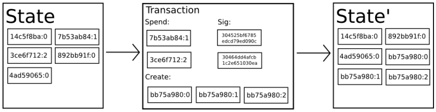

1~5쪽

# 차세대 스마트 컨트랙트와 탈중앙화된 어플리케이션 플랫폼 (A Next-Generation Smart Contract and Decentralized Application Platform) 
- 비트코인 = 통화분야에서 근본적인 혁신 (탈중앙화 자산의 가치)
- 또 다른 중요한 것 -> 분산 합의 기술(블록체인)
- 블록체인 활용기술: colored coin, smart property, namecoin, smart contracts, DAOs
- 이더리움의 튜링완전 프로그래밍 언어로 확장을 갑니다

# 목차
### 역사
- 상태변환시스템으로서의 비트코인 4
- 채굴 5
- 머클트리 7
- 블록체인 사용한 다른 사용사례 8
- 스크립팅 9

### 이더리움
- 이더리움 어카운트 11
- 메시지와 트랜잭션 11
- 이더리움 상태변환함수 13
- 코드실행 14
- 블록체인과 채굴 15

### 어플리케이션들
- 토큰 시스템 16
- 금융 파생상품 17
- 신원조회와 평판시스템 18
- 탈중앙화된 파일 저장공간 18
- 탈중앙화된 자율 조직 19
- 추가적인 어플리케이션들 20

### 기타 이슈들
- 수정된 GHOST 도입 22
- 수수료 23
- 연산과 튜링완전성 24
- 통화와 발행 26
- 채굴 중앙집중화 28
- 확장성 29

### 결 론 30
### 참고문헌과 추가 자료 

# 역사
1. 1980~90: e-cash -> 중앙화 문제
2. 1998: b-money 계산 퍼즐 -> 합의 매커니즘 부재
3. 2005: PoW 방식 발명 -> 중앙화 문제
4. 2009: bitcoin -> 암호학 + PoW 합의 매커니즘으로 해결

> **작업증명 (PoW: Proof of Work)**  
> 수학문제를 풀어서 남들에게 증명하는 것
1. 합의 문제 해결: 모두가 공동으로 동의
2. 방어 문제 해결: 시빌공격에 저항

> **시빌공격 (Sybil attack)**  
> 네트워크 보안에서 한 개체가 여러 가짜 신원을 가지고 네트워크에 대량으로 참여하여 시스템을 속이려는 공격 방식. 주로 분산 시스템에서 발생, 특히 신원 인증이 중요한 시스템에서 치명적

이후 지분증명(PoS: Proof of Stake) 등장. PoW와 PoS의 각 장단점 존재

| **구분**        | **작업증명 (PoW)**                     | **지분증명 (PoS)**                      |
|-----------------|------------------------------------------------------|-------------------------------------------------------|
| **개념**         | 수학적 문제(작업) 풀어 증명, 보상 | 자신의 가상화폐 지분에 비례하여 블록 생성, 보상 |
| **핵심 원리**    | 컴퓨터 자원을 사용해 신뢰성 확보 | 보유한 가상화폐 지분을 통해 합의를 유지 |
| **참여 방법**    | 계산 능력만큼 합의 | 코인을 가진만큼 합의 |
| **자원 소모**    | 높은 전기 소비           | 낮은 전기 소비               |
| **분산성**       | 높은 수준의 분산 보안 보장                 | 특정 노드들에 의존할 수 있음      |
| **장점**         | 보안적으로 검증된 방식, 블록 체인의 신뢰성 증가         | 환경적으로 친화적, 자원 효율성 높음, 중앙 집중 방지       |
| **단점**         | 전력 소모가 크고 환경적 부담, 스케일링 어려움           | 초기 부패성 공격 가능성, 높은 재분배 위험성              |

- 기술적 관점에서는 하나의 상태가 변하는 시스템 (state transition system)
`function 거래하기(장부) {장부 업데이트}`
> `APPLY(S,TX) -> S' or ERROR`

**은행에서는**  
`APPLY({ Alice: $50, Bob: $50 },"send $20 from Alice to Bob") = { Alice: $30, Bob: $70 }`  
상태(A와 B가 $50) + 트랜잭션(A->B $20를) = 상태(A: $30, B:$30)
`APPLY({ Alice: $50, Bob: $50 },"send $70 from Alice to Bob") = ERROR`  

비트코인에서는 `UTXO`(Unspent Transaction Outputs) = 장부모음 덩어리

## 채굴
- 중앙화 서비스에서 상태변화 간단하게 해결 가능: 서버 데이터만 변경
- 분산네트워크(비트코인)에서는 다수가 상태변화에 합의해야 함
- 비트코인에서는 `블록`(트랜잭션 패키지)이라는 바구니에 담아서 상태변환

**블록의 유효성 체크**  
1. 참조되는 이전 블록이 유효 확인
2. 타임스탬프 값이 이전 블록의 타임스탬프 값보다 크면서 2 시간 이내인지 확인
3. 작업증명(PoW) 유효 확인
4. 처음부터 새로운 블럭 이전블록까지의 모든블럭이 `이전블록` + `트랜잭션` = `다음블록` 일치하는지 계산 (중간블럭 데이터 위조 방지)

일치 계산 방식 (펼치기)

(4~6 프로그래밍 관련 설명 사진 넣기)

4-1. `S[0]`를 이전 블록의 마지막 상태(state)가 되도록 설정  
4-2. 트랜잭션 목록`TX`에서 `0...n-1`의 모든 i 에 대해, `S[i+1] = APPLY(S[i], TX[i])` 하나라도 에러를 리턴하면 거짓(false)을 리턴하며 종료  
4-3. 참(true)을 리턴하고, `S[n]`를 이 블록의 마지막 상태로 등록 (=새로운 블록 추가)  

