# 엔화의 역사
세계대전부터 현재까지 시간 흐름 역사

## 세계 2차대전 패

## 1. 미군 점령기 (1945-1952)
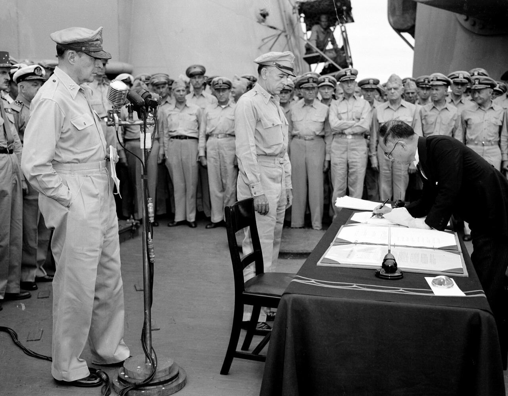

1. 세계2차대전 패배
2. 미군이 일본을 점령 
3. 전범국의 회생을 저지하기 위해 최고사령부 설치, 사회/문화 등 민주화 진행
4. 그런데 사회주의 국가가 주변에 너무 강함

## 2. 미국의 원조와 국제 경제 통합 (1950-1970)
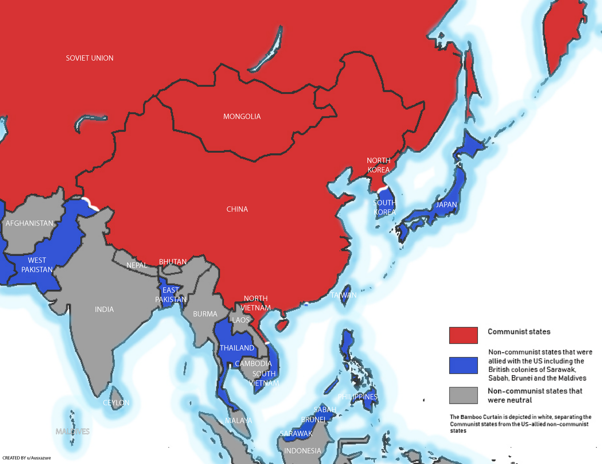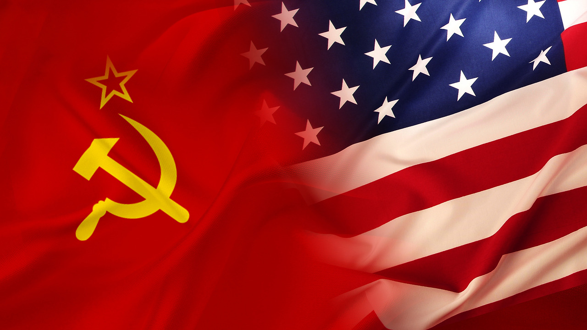

1. 미국의 안보를 위해 아시아권에서 사회주의 세력에 대항할 필요성이 생김
2. 일본의 경제 원조를 결정 (안보 책임지고, 경제 원조)
3. 한국 전쟁, 베트남 전쟁의 폭발적인 수요에 판매를 하며 경제 회복에 큰 도움을 받음
4. IMF, OECD, GATT 등 다양한 단체 가입하면서 국제 무역 경제까지 진출

## 3. 고도 경제 성장기 (1970-)
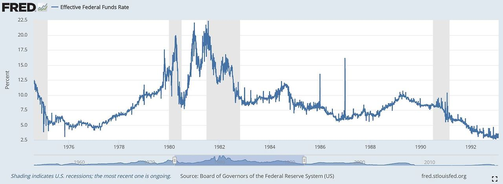  (미국금리)

1. 안보는 미국에게 맡기고, 경제 성장에 중점
2. 경제 성장: 정부 정책으로 중공업/자동차/전자/기술혁신 등 국제 시장에서 성공, 교육 강화까지
3. 오일쇼크 발생(1970,1979): 미국 금리 인상(20%) (물가를 잡기 위해(디플레이션 유도) + 달러 강화로 원자재 수입 유리) -> 미국 기업 박살 -> 경제가 조금 둔화되며 물가는 잡힘 -> 일본의 수출 좋아짐 (에너지 효율성을 높이는 정책+미국기업박살+엔화 약세(미국 금리가 높아 미국으로 돈이 움직여서 달러 강세됨))

## 4. 경제대국 (1985-)
1. 오일쇼크 이후 미국의 안좋은 경제상황을 달러 약화로 타개(플라자합의) -> `빚 탕감`(부채 부담 감소) + `수출 이득`
2. 엔화 강세 -> 일본은 수출이 어려워져 내수경기 부양 정책으로 변경 -> 일본으로 자본 이동 -> 주가 상승 (시장으로 자본이 많이 들어와서 회사들이 은행(대출 이자)에서 돈을 빌리지 않게 됨 왜냐면 투자받기 쉬움)
3. 은행들이 가계를 대상으로 사업시작(주택담보대출비율=120% (현재 우리나라는 40%)) -> `저금리 + 자본유입 + 은행경쟁`으로 부동산 시장 계속 상승

## 5. 버블 (1985-1989)
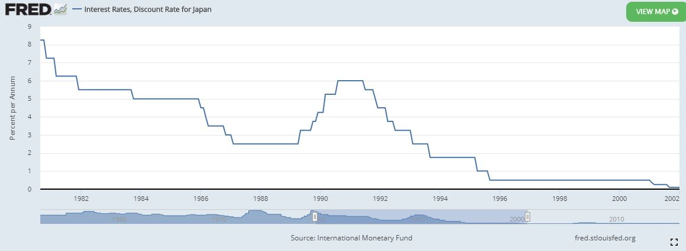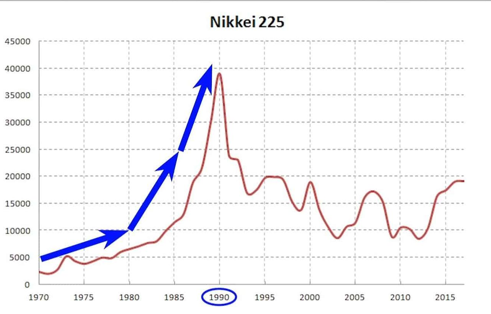 (1)일본금리 (2)일본주식

1. 1987년 미국 주식(다우지수) 22% 대폭락 (버블 터짐) -> 미국이 시장에 큰 타격이 가지 않게 금리 인하 (돈 풀어서 활성화), 미국 은행이 다른 나라 은행에 금리 인하 요청 (자본이 금리 높은곳으로 이동해서 미국 경제가 둔화되는것을 막으려고)
2. 하지만 일본은 지금 시장에 돈이 많아서(인플레이션 상황) 금리 인하 못함
3. 1989년 미국이 일본 성장 제제 (미일 구조 협의) -> 내수 시장 개방, 일본의 수출을 줄이고 수입을 많이 하도록 유도
4. 일본 정부 국토 부동산 재개발(대규모 일자리로 내수시장 활성화) -> 물가 오르기 시작(대출 더 받으며) -> 정부: 금리 대폭 인상 -> 주가 40% 폭락 -> 부동산 폭락
5. 버블 터지면서 경제 패닉 시작

## 6. 버블 이후 1 (1990-)
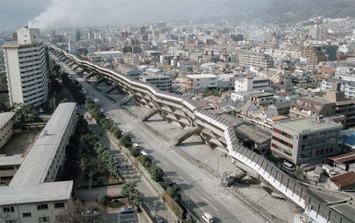  (1)고베대지진 (2)걸프전

1. 심한 패닉 경제 부양을 위해 금리 인하를 빠르게 해야하는데, 세계상황: "걸프전으로 유가 상승 -> 물가상승이 됨, 그런데 금리 낮추면 물가가 더 올라가는것" 을 방지하기 위해 금리 인하 속도를 늦춤
2. 너무 느린 금리 인하로 시장이 얼어버림
3. 정부는 도로건설 등 활성화 유도, 금리 계속 인하했지만.. 지진까지 발생
4. 기업과 보험회사가 해외자본을 엔화로 바꿔서 재건에 도움 -> 엔화 초강세 됨 -> 수출 어려워 짐 
5. G7회담에 엔화 약세 요구, 금융기관 부실 문제가 경제에 영향이 큰거같아서 정책 변경 (금융기관을 통해 유동성을 공급해서 경기부양이 최선인것 같다)

## 7. 버블 이후 2
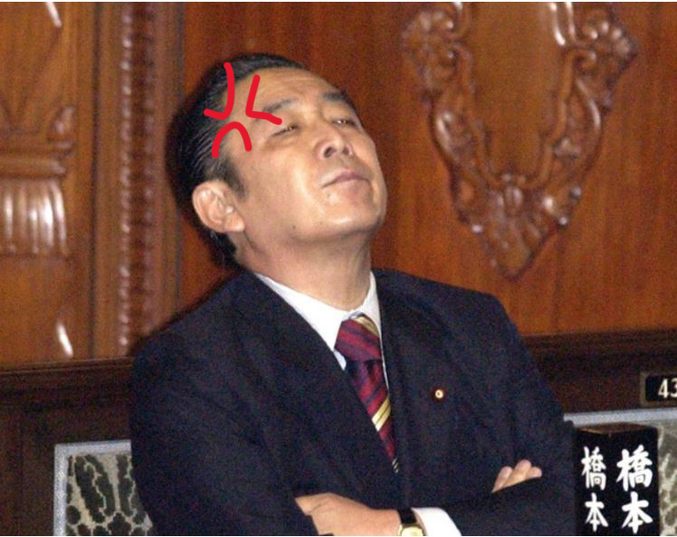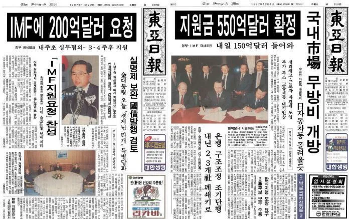  (1)머리아픈 일본인 (2)IMF 구제금융
1. 그런데 금융기관 유동성 공급으로 시장 활성화가 아닌, 눈앞의 불을 끄기 위해 부동산 경기부양에 직접 재정 낭비를 함 (미국은 2008년 경제 대공황때, 이 사건을 보고 금융기관에 유동성 공급을 함)
2. 정부가 빚을 내며 경기 부양 시도 (1996, GDP대비 70%)
3. 재정 빚 탕감을 위해 세금 업 -> 경기 둔화
4. 1997 아시아 외환위기 -> 일본기업들의 외국 시장에 투자한 자본이 하락함 -> 은행, 증권사 파산

## 7. 버블 이후 3 (2000-)
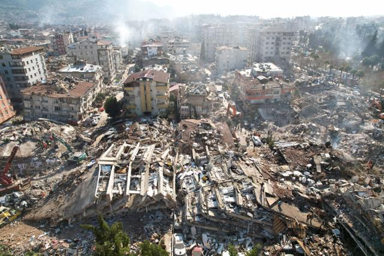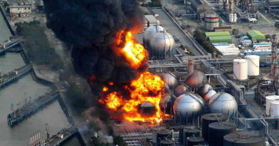  (1)리만브라더스 사태 (2)동일본 대지진 (3)후쿠시마 원전 폭발
1. 이제 금융기관을 중심으로 살리기 시작 (금융기관에게 부실채권 청산 요구)
2. 부실 기업 청산됨 -> 실업자 증가 -> 잠시 경기둔화
3. 추가로 정부 빚 탕감을 위해 5년간 통화 발행 시작 -> 인플레이션 -> 토지, 수출 완화되서 경기 살아남
4. 인플레이션 무서워서 잠시 발행 중지 
5. 미국 경제대공황 발생 -> 미국 금리 축소 -> 일본으로 자본 움직여서 엔화 강세
6. 2011년 동일본 대지진 -> 엔화 더블 강세
7. 후쿠시마 원전사고 -> 엔화 더블더블 강세
8. 경제와 수출 둔화

## 8. 아베 당선 (2010~)
1. 재선당시 경제 상황이 안좋아 민주당 패배 후 아베 당선
2. 경기 부양을 위해 3개 화살 정책 시행, 무제한 통화 발행 시작(국채 발행 후 매입) -> 통화가치 하락

## 9. 양적완화 실행
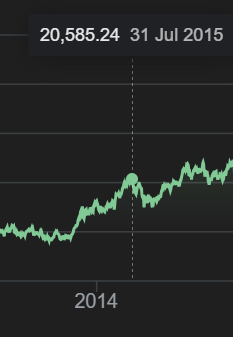  
1. 양적완화/질적완화 다양한 방법으로 경기부양 시도 (2015년까지 효과)
2. 장기국채 인기가 높아져서 시장 참여자들이 매도를 안하게 됨(통화 공급이 안됨) + 중국 부채위기(엔화 매입) -> 엔화 다시 강세
3. 시중은행은 경제상황이 안좋아서 중앙은행에 역으로 돈을 예치해서 이자를 얻음 -> 시장 통화 공급이 안됨
4. 마이너스 금리 시작 -> 돈을 중앙은행에 예치하면 손실
5. 시중은행의 선택: 일본 국채를 매입. 왜냐면 일본은 계속 통화 공급을 위해 국채 매입을 할것이기 때문에 가격이 올라갈것이므로 -> 장단기금리역전현상(시장에 돈을 못 뿌리게 되서 금융위기 확률이 올라감)
6. 버냉키의 도움으로 MMT대신 YCC정책 사용해서 시장에 통화 공급 시작

# 느낀점
- 너무 복잡하다
- 금융위기는 미국처럼 기축통화 발권력을 가진 나라가 아니면 왠만해서 정상적으로 살아니기 힘든거같다.
- 상황에 따라서 외수시장과 내수시장 초점을 맞춰서 경기를 부양하는것 같다
- 수출은 경기를 부양(상승 유도)하는데 좋은것 같고, 수입은 경기 하락을 방어하는데 좋은것 같다.

# 참고
- [일본 경제 역사](https://monsterofcapitalistic.tistory.com/category/%EC%9D%BC%EB%B3%B8%20%EA%B2%BD%EC%A0%9C%20%EC%97%AD%EC%82%AC?page=1)

# 단어
- 장단기금리역적현상: 
